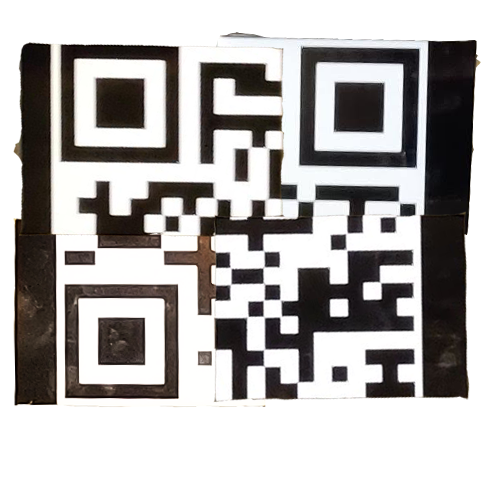

# Challenge Summary
* While I didn't get nearly as far as I wanted to, I am happy with the current solutions for thresholding to identify the code + clustering to differentiate between the code and any other objects
* All in all I spent a few hours working on this (including research)

# Code Summary
  * All the code is in the main directory
  * Images are stored in subdirectories (the original images are in raw_images)
  * `run.py` is where all of the actual outputs are intended to be generated
  * `analysis.py`, `boundboxing.py`, `canny_contouring.py`, `image_compression.py`, `thresholding.py`, and `util.py` are all modules that hold the functions used in `run.py` or by each other.

## Before you run
* First you'll need to get Python. I used python 3.7.1 (for 64-bit windows, but that shouldn't matter).
* Next, you'll need to install the right python packages to allow the code to run
### If you use conda/anaconda
* You can use [`pennairapp_reqs.yml`](pennairapp_reqs.yml) to create the environment
  * Ex: 
```cmd
> conda env create --file pennairapps_req.yml --name pennairapp
> conda activate pennairapp
```

### If you use pip / just want a list of packages
* pip is the 
1. numpy
2. scipy
3. matplotlib
4. scikit-image
5. scikit-learn
* Run
```cmd
> pip install numpy
> pip install scipy
...
```
* If things aren't working out and you want specific versions of each package, see [`pennairapp_reqs.txt`](pennairapp_reqs.txt)
  * See [here](https://pip.pypa.io/en/stable/) for the docs for pip if you need to install a specific version of a package

## Run the Code
* (if you are using conda make sure you activate the environment. If you are using pip's virtual env, make sure you activate that)
```cmd
> python ..../run.py 
```
* Where `..../run.py` is the path to `run.py` on your system

# Other Info
Email me at [aagamd@seas.upenn.edu](mailto:aagamd@seas.upenn.edu) if you have any trouble! If need be, I can simply email you images after each stage of the image pipeline.
* Within `run.py` you can similarly see where I was planning to go
* Below you can find some research and thinking I did before I started and also some of how my solution evolved

____
# Problem Parameters
* 4 parts to the QR code
* All of approximately equal size
* May be some ovealap between the pieces
* Pieces may need to be re-oriented to fit
* QR code is of version 1 and error correction level H

## Assumptions
* The qr codes are of roughly equal sizes

# QR Code Version 1 Design
* Version 1 means a 21 x 21 px qr code

* V1 QR code in H mode can store up to 41
* Sizing information


## ECC (Level H)
* Level H is 30% ECC
  * Means if 30% of 8bit code words are lost, the value of the QR code can still be recovered
  * *Potentially, this means only 3 quarters are needed*
* Uses reed-solomon

## Encoding information
* Core unit appears to be 4x2 rectangle (total of 8 bits, 1 byte)
 * This is called a module (per [this detailed doc on QR specs](./qr_standard.pdf))
 * According to this, the module are read right to left, bottom to top (when we look at the QR code s.t. the eyes are at top left, bottom left, top right)
* There is a mode indicator at the bottom right
  * 0001 indicates numerical
* Then above that is the char count indicator ()
* Then data starts by snaking around each column


### Orientation Information
* 3 eyes in top left, bottom left, top right
* Potentially a small orientation one in the bottom right

### Data Masking
* Data is masked to ensure best efficiency

# Get a sense for the solution: Photoshop

* When scanned, produces a value of 0106
  * We can also see by examining the very bottom left 2x2 square that the encoding mode must be numerical
* What processes did I use to piece it together?
  * Orientation of the 3 eyes

# Part 1: Computer Vision

## Defining Characteristics of a QR code
### Shape
QR code pieces are square, which means that they will always have 4 corners (no matter angle of photography etc)

### Color
* Our QR codes are white with black data
  * This contrast with their background which is black (but also can have lots of glare, making it appear close to yellow)
* The given QR code has a greater lustrousness than its surroundings

### Pattern
* The QR alternates between white and black, producing high contrast regions
* The QR has eyes which encode orientation

## Defining the solution
### Understanding
* **Core problem** is to determine where the relevant pixels lie
* see above

### Defining In/Out
* In: an image (rgb?)
* Out: any of
  * a list of pixels
  * bounding box (l, r) (t, b)
  * lines

### Test Cases
* The given images (visually analyzing them)
* Any additional test cases will be added under test

### Implementation Plan (see code)
* The method of using the color difference seems most promising
* Potentially will need to fit the pixels we get to a quadrilateral

## Actual Solution
* Rather than try to cut out the entire QR code section, only look at the white part of the QR code since that has greatest contrast
* Since QR codes are binary, we can easily define negative space later on
* Thresholding often yields QR code + a shoe + some noise -> need to seperate them
  * Usually all of these are spaced far apart
  * A clustering algorithm like DBSCAN could be used